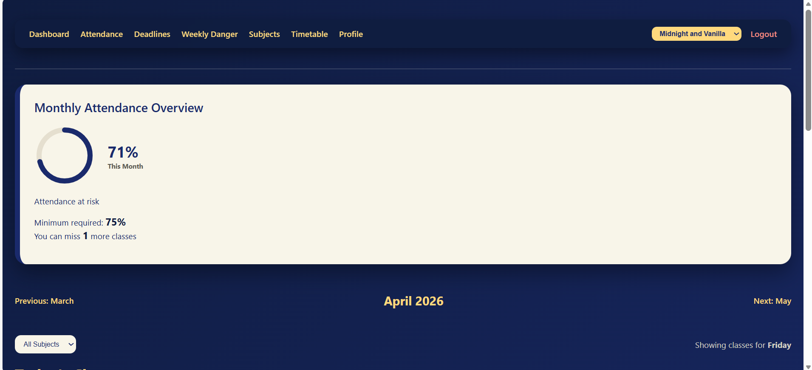
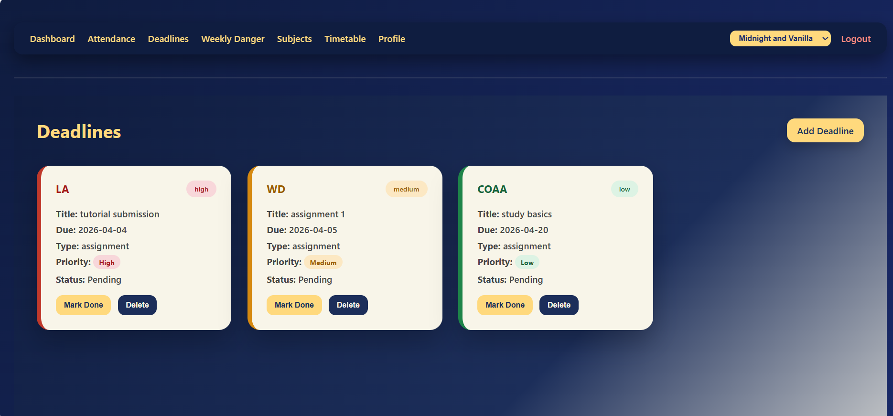
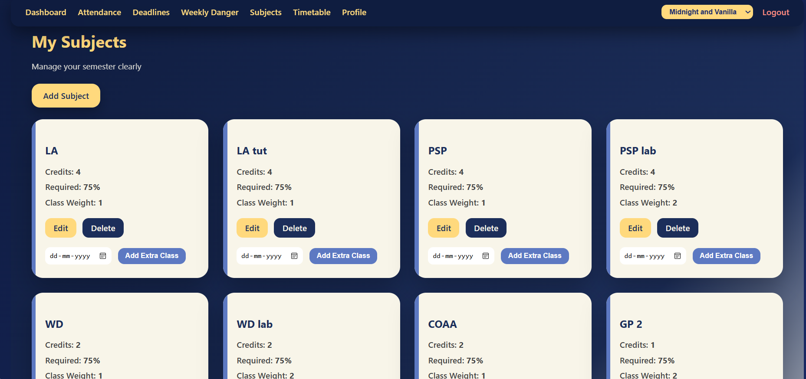
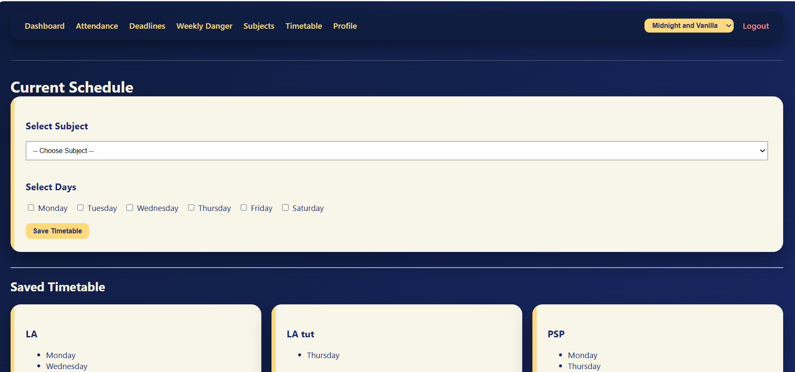
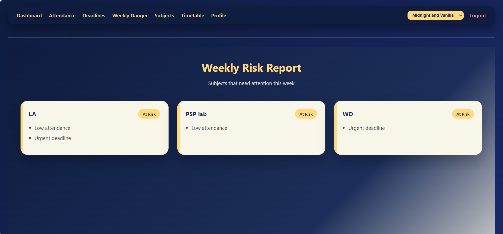
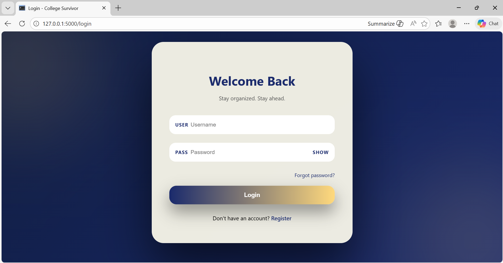

#  College Survivor

**Stay organized. Stay ahead.**

College Survivor is a full-stack academic productivity web app designed to help students manage attendance, track deadlines, and stay in control of their college life.

---

##  Overview

Built over 1–2 months through continuous iteration, debugging, and improvement, this project focuses on solving real student problems like attendance tracking and deadline management.

It reflects not just development, but also problem-solving, persistence, and system design.

---

##  Features

*  **Attendance Tracking**
  Track subject-wise attendance with accurate percentage calculations.

*  **Skip Calculator**
  Instantly know how many classes you can safely skip.

*  **Deadline Management**
  Organize assignments and track upcoming deadlines.

*  **Dashboard Overview**
  Get a quick summary of performance and risk areas.

*  **Authentication System**
  Secure login and registration using hashed passwords.

---
##  Screenshots


### Attendance


### Deadlines


### Subjects


### Timetable


### Weekly Report


### Login Page

---

##  Key Highlights

* Built a full-stack web application from scratch
* Designed and implemented a relational database schema
* Solved real-world issues like data persistence and authentication bugs
* Refactored and stabilized a previously breaking system
* Focused on usability and practical student needs

---

##  Tech Stack

* **Backend:** Python, Flask
* **Database:** SQLite
* **Frontend:** HTML, CSS, JavaScript
* **Authentication:** Werkzeug Security

---

##  Project Structure

```id="g5v0k8"
├── app.py
├── schema.sql
├── templates/
├── static/
├── screenshots/
└── README.md
```

---

##  Setup & Installation

1. **Clone the repository**

```bash id="3l2b3c"
git clone https://github.com/riddhii-iii/College-survivor.git
cd College-survivor
```

2. **Create virtual environment (recommended)**

```bash id="r5b3xz"
python -m venv venv
venv\Scripts\activate
```

3. **Install dependencies**

```bash id="dz6y6f"
pip install flask python-dotenv
```

4. **Initialize the database**

```bash id="x7yq0r"
sqlite3 college.db < schema.sql
```

5. **Run the app**

```bash id="v1o9mj"
python app.py
```

6. Open in browser:

```
http://127.0.0.1:5000/
```

---

##  What I Learned

* Building a full-stack Flask application
* Designing and managing relational databases
* Debugging real-world issues and fixing broken logic
* Structuring scalable and maintainable code
* Handling edge cases and improving system stability

---

## Future Improvements

* Email reminders for deadlines
* Advanced analytics & insights
* Improved UI/UX
* Deployment (Render / Railway / AWS)

---

##  Contributing

Contributions, feedback, and suggestions are welcome!

---

##  Support

If you found this project useful, consider giving it a star 

---

##  Connect

Feel free to connect or share feedback!

